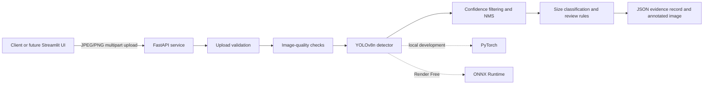

# CVision Box Intake

Research prototype for detecting and counting visible cardboard cartons from a
single image before barcode or OCR confirmation.

The service returns detection evidence, relative size classes, image-quality
signals, and conservative human-review guidance. It is designed to demonstrate
an understandable and testable computer-vision workflow—not autonomous
warehouse counting or a production deployment claim.

## Project Status

| Area | Status |
| --- | --- |
| FastAPI backend | Implemented and deployed on Render Free |
| Production inference | ONNX Runtime on CPU |
| Development inference | Fine-tuned YOLOv8n through PyTorch |
| Current project and service version | `0.8.0` |
| Reviewed evaluation set | 31 images |
| Full-set exact-count accuracy | 18/31, or 58.1% |
| Supported-scene exact-count accuracy | 18/30, or 60.0% |
| Human-review routing | Implemented; never changes counts automatically |
| Streamlit frontend | Not yet implemented in this repository |
| Production readiness | Research prototype only |

### Live Backend

- API root: <https://cvision-box-intake-api.onrender.com>
- Health: <https://cvision-box-intake-api.onrender.com/health>
- Version: <https://cvision-box-intake-api.onrender.com/version>
- Interactive OpenAPI docs: <https://cvision-box-intake-api.onrender.com/docs>

Render uses the Free plan and must remain below its 512 MB memory limit. The
service can cold-start after inactivity.

## Problem and Scope

An intake operator often needs a visual estimate of the physical load before
identifying every carton individually. This prototype answers:

- How many distinct cartons are visibly identifiable?
- Where are they in the image?
- What is their rough image-relative size class?
- Is the image or detection pattern risky enough to require human review?
- What evidence and metadata should accompany the result?

The prototype does not perform barcode recognition, OCR, physical dimension
measurement, damage classification, authentication, or warehouse-system
integration.

## Architecture



Production avoids importing Torch and Ultralytics at runtime. Render exports
the committed PyTorch checkpoint during the build, removes the export-only
stack, and installs the smaller ONNX Runtime dependency set.

## Counting Rule

A carton counts when its visible region is sufficient to identify it as a
distinct physical carton.

- Include identifiable partial, border-cropped, damaged, open, and wrapped
  cartons.
- Annotate only the visible region.
- Exclude extremely small or ambiguous fragments that cannot be separated
  reliably.
- Exclude wooden crates, luggage, plastic containers, furniture, shadows, and
  reflections.
- One accepted detection after confidence filtering and non-maximum suppression
  contributes one carton to the returned count.

Review rules do not merge, add, or remove detections. They only warn that the
operator should inspect the evidence.

## API

| Method | Path | Purpose |
| --- | --- | --- |
| `GET` | `/health` | Lightweight liveness check |
| `GET` | `/version` | Service, model, backend, and schema versions |
| `POST` | `/v1/box-intake/infer` | Validate and analyze one uploaded image |

### Upload Contract

- Multipart field: `file`
- Accepted content types: JPEG and PNG
- Maximum upload size: 10 MB by default
- Empty, unsupported, corrupted, and oversized files receive clear `4xx`
  responses.
- Model loading or inference failures receive a sanitized `503` response.
- Zero detections is a valid `200` result that requires human review.

Example request:

```powershell
curl.exe -X POST "http://127.0.0.1:8000/v1/box-intake/infer" `
  -F "file=@eval/dataset/images/img_001.jpg"
```

### Response Shape

```json
{
  "schema_version": "1.1",
  "event_type": "box_intake_scan",
  "request_id": "generated-uuid",
  "created_at": "2026-08-04T12:00:00+00:00",
  "image": {
    "width": 762,
    "height": 501,
    "quality_flags": []
  },
  "detections": [
    {
      "id": 1,
      "bbox_xyxy": [100, 80, 420, 390],
      "confidence": 0.93,
      "size_class": "large",
      "area_ratio": 0.2597,
      "touches_edge": false
    }
  ],
  "visible_box_count": 1,
  "size_summary": {
    "small": 0,
    "medium": 0,
    "large": 1
  },
  "confidence_score": 0.93,
  "human_review_required": false,
  "review_reasons": [],
  "count_risk": {
    "suspicious_fragment_pair_count": 0
  },
  "model": {
    "name": "carton-yolov8n",
    "version": "ft-v1",
    "conf_threshold": 0.47,
    "iou_threshold": 0.25,
    "backend": "onnx"
  },
  "service": {
    "version": "0.8.0"
  },
  "runtime_memory": {
    "current_rss_mb": 169.4,
    "peak_rss_mb": 194.4
  },
  "processing_time_ms": 412,
  "annotated_image_png_b64": "base64-encoded JPEG evidence"
}
```

The example illustrates the contract; numeric values vary by image and runtime.

## Review and Quality Signals

| Reason | Trigger | Meaning |
| --- | --- | --- |
| `no_boxes_detected` | Accepted count is zero | The model found no usable carton evidence |
| `low_confidence_detection` | Any accepted detection is below `0.45` | At least one detection is weak |
| `boxes_cut_off_at_edge` | More than 20% touch the frame | Border truncation may hide carton extent |
| `high_detection_count` | At least 12 detections | Crowded geometry increases count risk |
| `possible_fragmented_detections` | Adjacent aligned regions meet conservative geometry rules | One carton may have produced separate regions |
| `poor_image_quality` | Resolution, blur, or exposure flag fires | The visual evidence itself is weak |

Image-quality flags are `low_resolution`, `possible_blur`, `underexposed`, and
`overexposed`. They apply a review-only confidence penalty and never alter
detections.

## Relative Size Classes

Physical carton dimensions cannot be recovered reliably from one image without
depth or a reference object. Size classes are therefore based on bounding-box
area relative to image area:

| Class | Area ratio |
| --- | ---: |
| `small` | `< 0.03` |
| `medium` | `0.03` through `0.10` |
| `large` | `> 0.10` |

The same physical carton can receive a different class when photographed from a
different distance.

## Repository Layout

| Path | Purpose |
| --- | --- |
| `app/` | FastAPI application, configuration, schemas, inference, quality, review logic, and telemetry |
| `tests/` | Endpoint, preprocessing, NMS, quality, and count-risk regression tests |
| `eval/dataset/` | Tracked 31-image evaluation set and reviewed count manifest |
| `eval/` | Reproducible evaluation, risk-analysis, and threshold-tuning utilities |
| `scripts/` | Training, leakage audit, benchmarking, ONNX export, Render build, and deployment smoke test |
| `models/` | Selected committed PyTorch checkpoint; exported ONNX remains generated |
| `docs/` | Model decisions, annotated examples, error analysis, deployment evidence, and handoff guidance |
| `.github/workflows/ci.yml` | Pull-request and permanent-branch quality gate |
| `render.yaml` | Render Free backend blueprint |
| `requirements.txt` | Development, training, and ONNX-export dependencies |
| `requirements-render.txt` | Lightweight production runtime dependencies |

## Local Development

### Requirements

- Python 3.11
- Git
- PowerShell commands below, or equivalent commands for another shell
- Sufficient memory for the local PyTorch development stack

### Install

```powershell
git clone https://github.com/ZahraAbbas595/cvision-box-intake.git
Set-Location cvision-box-intake
python -m venv .venv
.\.venv\Scripts\Activate.ps1
python -m pip install --upgrade pip
python -m pip install -r requirements.txt
python -m pip install -e ".[dev]"
Copy-Item sample.env .env
```

`sample.env` contains non-secret examples. Do not commit a real `.env` file,
credentials, tokens, or service secrets.

### Run

```powershell
uvicorn app.main:app --reload
```

Then open:

- API docs: <http://127.0.0.1:8000/docs>
- Health: <http://127.0.0.1:8000/health>
- Version: <http://127.0.0.1:8000/version>

Local development defaults to the committed PyTorch model. To exercise ONNX
locally, export the model first and set `MODEL_BACKEND=onnx`.

## Configuration

| Variable | Local default | Purpose |
| --- | ---: | --- |
| `MODEL_BACKEND` | `pytorch` | Select `pytorch` or `onnx` inference |
| `CONF_THRESHOLD` | `0.45` | Minimum accepted detection confidence |
| `IOU_THRESHOLD` | `0.30` | NMS overlap threshold |
| `INFERENCE_IMAGE_SIZE` | `640` | Detector input target size |
| `MAX_UPLOAD_BYTES` | `10485760` | Maximum request image size |
| `LOW_CONFIDENCE_THRESHOLD` | `0.45` | Review threshold for accepted detections |
| `EDGE_MARGIN_PX` | `5` | Pixel margin used to identify edge contact |
| `EDGE_REVIEW_RATIO` | `0.20` | Edge-contact fraction that triggers review |
| `HIGH_DETECTION_COUNT` | `12` | Crowded-scene review threshold |
| `MIN_IMAGE_DIMENSION` | `200` | Minimum image width or height |
| `BLUR_VARIANCE_THRESHOLD` | `50.0` | Minimum Laplacian variance |
| `DARK_MEAN_THRESHOLD` | `40.0` | Underexposure threshold |
| `BRIGHT_MEAN_THRESHOLD` | `215.0` | Overexposure threshold |

Fragment-geometry variables are also listed in `sample.env`. Render overrides
the confidence and IoU settings to the validated ONNX values `0.47` and `0.25`.

## Validation

Run the same supported checks as CI:

```powershell
python -m ruff check app tests
python -m ruff format --check app tests
python -m mypy app/config.py app/schemas.py
python -m pytest -q
```

CI runs on pull requests and pushes to `dev` or `main` using Python 3.11.

## Evaluation

The reviewed count source of truth is
`eval/dataset/ground_truth.json`. Run the standard evaluator with:

```powershell
python eval/run_eval.py
```

Additional evidence utilities:

```powershell
python eval/tune_thresholds.py
python eval/tune_onnx_thresholds.py
python eval/analyze_count_risks.py
```

Current reviewed ONNX results:

| Metric | Full set | Supported scenes |
| --- | ---: | ---: |
| Images | 31 | 30 |
| Exact counts | 18 | 18 |
| Exact-count accuracy | 58.1% | 60.0% |
| Mean absolute count error | 1.42 | 1.43 |
| Overcount images | 6 | 5 |
| Undercount images | 7 | 7 |

The supported-scene subset excludes only the predeclared reflection case while
the full-set result remains the primary honest metric. See
`docs/error_analysis.md` for every mismatch, the error taxonomy, and visual
examples.

Generated CSVs, contact sheets, broad overlay runs, and response captures remain
ignored. Only five explicitly curated historical baseline overlays are tracked
under `docs/examples/`.

## Model History

1. Generic COCO YOLOv8n was rejected because COCO has no carton class.
2. YOLO-World proved zero-shot carton detection was possible but overcounted
   crowded scenes and exceeded Render Free memory.
3. A carton-specific YOLOv8n model was fine-tuned from a public Roboflow
   dataset.
4. PyTorch inference still exceeded the free-instance memory budget.
5. Dynamic-shape ONNX Runtime became the production path and remained safely
   below 512 MB during live smoke testing.

Model provenance, leakage limitations, training metrics, and runtime evidence
are documented in `docs/model_decision.md`, `docs/finetuning_findings.md`, and
`docs/production_inference_validation.md`.

## Training and Reproducibility

The selected model is already committed. Retraining is not required to run the
application.

To reproduce fine-tuning with the local ignored Roboflow dataset:

```powershell
python scripts/train_yolov8.py --data dataset/data.yaml
```

To reproduce the dataset leakage audit:

```powershell
python scripts/audit_dataset_leakage.py --help
```

Training outputs belong under ignored `runs/`. Do not commit arbitrary
checkpoints, downloaded datasets, or weights.

## ONNX and Render Deployment

Manual export:

```powershell
python scripts/export_onnx.py
```

Render executes `scripts/render_build.sh`, which:

1. installs the export dependencies;
2. exports dynamic-shape ONNX from the committed checkpoint;
3. removes Torch, Torchvision, Ultralytics, ONNX, and GUI OpenCV;
4. installs `requirements-render.txt`;
5. verifies the ONNX input/output contract before startup.

Do not commit the exported `.onnx` file. Do not upgrade Render to a paid plan;
optimize below 512 MB if memory regresses.

Deployment smoke test:

```powershell
python scripts/smoke_render.py `
  https://cvision-box-intake-api.onrender.com `
  eval/dataset/images/img_001.jpg
```

## Troubleshooting

### Model file is missing

Confirm `models/carton_yolov8n_best.pt` exists. ONNX mode additionally requires
the generated `.onnx` file; run `scripts/export_onnx.py` locally or let the
Render build create it.

### The first live request is slow

Render Free can sleep after inactivity. Allow the first request extra time and
retry only after the service has had time to wake.

### The API returns `503`

Inspect structured application logs using the returned `request_id`. A `503`
represents model loading or inference failure; raw internal exceptions are not
returned to clients.

### Counts differ from human review

Inspect `detections`, `review_reasons`, `image.quality_flags`, and the annotated
evidence image. Do not silently correct the count. Record the outcome for future
model evaluation.

### Local Python commands fail

Recreate the Python 3.11 virtual environment and reinstall from the committed
requirements. Caches, virtual environments, and editable-install metadata are
local artifacts and must remain uncommitted.

## Known Limitations

- Dense stacks can miss small, partial, border, or heavily occluded cartons.
- Damaged or visually separated carton regions can create duplicate detections.
- Rectangular windows, furniture, shadows, and reflections can create false
  positives.
- Stylized, open, dark, blurred, or low-resolution cartons can be missed.
- Image-quality checks are heuristic and require warehouse-specific validation.
- Relative size classes are not physical measurements.
- The evaluation set is small and intentionally contains difficult scenes.
- Public training data contains visually related images across splits, which
  inflates conventional validation metrics.
- The API has no authentication, secure evidence store, retention policy,
  monitoring service, WMS/POD integration, or review-feedback pipeline.
- A Streamlit frontend is still required for the complete sprint interface.

## Documentation Map

| Document | Purpose |
| --- | --- |
| `CHANGELOG.md` | Milestones and differences from previous project stages |
| `docs/model_decision.md` | Baseline experiments and model selection |
| `docs/finetuning_findings.md` | Training, leakage, count, and runtime evidence |
| `docs/production_inference_validation.md` | ONNX parity, threshold, memory, and live deployment evidence |
| `docs/error_analysis.md` | Current reviewed metrics, mismatches, taxonomy, examples, and limitations |
| `docs/examples/README.md` | Curated annotated historical baseline overlays |
| `docs/handoff_and_cleanup.md` | Supported workflow, cleanup policy, and release checklist |

## Git and Contribution Workflow

- `main` represents the stable demonstration release.
- `dev` represents integrated development.
- Start each change from an updated `dev` branch.
- Use descriptive prefixes such as `feat/`, `fix/`, `test/`, `docs/`, or
  `chore/`.
- Keep each commit and pull request focused.
- Require green CI before merging.
- Merge through pull requests; never commit directly to `dev` or `main`.
- Update `README.md` and `CHANGELOG.md` together whenever a meaningful change
  affects behavior, setup, operation, evaluation, deployment, limitations, or
  project status.

Never commit secrets, real `.env` files, downloaded datasets, arbitrary model
weights, exported ONNX files, response captures, generated CSVs, or broad
evaluation artifact directories without an explicit reviewed exception.

## Next Milestone

The next sprint priority is a Streamlit interface that:

1. uploads and previews an image;
2. calls the hosted FastAPI backend;
3. displays annotated evidence, count, sizes, confidence, and review reasons;
4. offers the structured result for download;
5. handles Render cold starts, timeouts, and backend failures clearly.

After frontend deployment and end-to-end acceptance testing, promote the stable
`dev` state to `main` through a release pull request.
