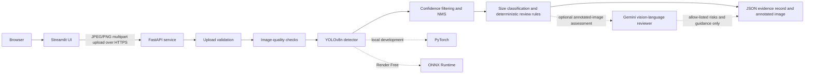

# CVision Box Intake

Research prototype for detecting and counting visible cardboard cartons/boxes
inside a truck from a single image before barcode or OCR confirmation.

The service returns detection evidence, relative size classes, image-quality
signals, and conservative human-review guidance. It is designed to demonstrate
an understandable and testable computer-vision workflow—not autonomous
truck-load counting or a production deployment claim.

## Project Status

| Area | Status |
| --- | --- |
| FastAPI backend | Implemented and deployed on Render Free |
| Production inference | ONNX Runtime on CPU |
| Development inference | Fine-tuned YOLOv8n through PyTorch |
| Current project and service version | `0.9.0` |
| Locked truck evaluation set | 105 images, 8,107 cartons |
| External precision / recall | 89.9% / 84.7% |
| Highest observed Render peak RSS | 426.4 MB of 512 MB |
| Human-review routing | Deterministic rules plus optional advisory Gemini review; never changes counts automatically |
| Streamlit frontend | Deployed on Streamlit Community Cloud |
| Staging environment | Separate free-tier Render and Streamlit deployments from `stage`; smoke tested end to end |
| Production readiness | Research prototype only |

### Live Backend

- API root: <https://cvision-box-intake-api.onrender.com>
- Health: <https://cvision-box-intake-api.onrender.com/health>
- Version: <https://cvision-box-intake-api.onrender.com/version>
- Interactive OpenAPI docs: <https://cvision-box-intake-api.onrender.com/docs>

### Live Frontend

- Streamlit prototype: <https://cvision-box-intake.streamlit.app/>

The frontend deploys from `dev` and reads the Render URL from an encrypted
Streamlit secret. Manual truck-image acceptance is recorded in
`docs/truck_model_evaluation.md`.

### Staging Environment

- API root: <https://cvision-box-intake-api-stage.onrender.com>
- Health: <https://cvision-box-intake-api-stage.onrender.com/health>
- Version: <https://cvision-box-intake-api-stage.onrender.com/version>
- Streamlit: <https://cvision-box-intake-stage.streamlit.app/>

Both staging services deploy from `stage` and use free hosting. The staging API
uses ONNX Runtime within Render's 512 MB limit, and the Streamlit app reads its
API URL from an encrypted secret. API and browser upload smoke checks passed on
2026-08-18. Advisory Gemini review remains disabled in staging until its API key
is added to the staging secret store and verified there; deterministic review
signals remain active.

Operators can either select a JPEG/PNG file or capture a new photo using the
device camera. When the backend flags blur, poor exposure, or low resolution,
the UI identifies the issue and asks the operator to retake or re-upload before
trusting the result.

Render uses the Free plan and must remain below its 512 MB memory limit. The
service can cold-start after inactivity.

## Problem and Scope

An intake operator often needs a visual estimate of the cartons/boxes inside a
truck before identifying every carton individually. This prototype answers:

- How many distinct cartons are visibly identifiable?
- Where are they in the image?
- What is their rough image-relative size class?
- Is the image or detection pattern risky enough to require human review?
- What evidence and metadata should accompany the result?

The prototype does not perform barcode recognition, OCR, physical dimension
measurement, damage classification, authentication, or warehouse-system
integration.

## Architecture



Production avoids importing Torch and Ultralytics at runtime. Render exports
the committed PyTorch checkpoint during the build, removes the export-only
stack, and installs the smaller ONNX Runtime dependency set.

## Counting Rule

A carton counts when its visible region is sufficient to identify it as a
distinct physical carton.

- Include identifiable partial, border-cropped, damaged, open, and wrapped
  cartons.
- Annotate only the visible region.
- Exclude extremely small or ambiguous fragments that cannot be separated
  reliably.
- Exclude wooden crates, luggage, plastic containers, furniture, shadows, and
  reflections.
- One accepted detection after confidence filtering and non-maximum suppression
  contributes one carton to the returned count.

Review rules do not merge, add, or remove detections. They only warn that the
operator should inspect the evidence.

## API

| Method | Path | Purpose |
| --- | --- | --- |
| `GET` | `/health` | Lightweight liveness check |
| `GET` | `/version` | Service, model, backend, and schema versions |
| `POST` | `/v1/box-intake/infer` | Validate and analyze one uploaded image |

### Upload Contract

- Multipart field: `file`
- Accepted content types: JPEG and PNG
- Maximum upload size: 10 MB by default
- Empty, unsupported, corrupted, and oversized files receive clear `4xx`
  responses.
- Model loading or inference failures receive a sanitized `503` response.
- Zero detections is a valid `200` result that requires human review.

Example request:

```powershell
curl.exe -X POST "http://127.0.0.1:8000/v1/box-intake/infer" `
  -F "file=@C:\path\to\truck-image.jpg"
```

### Response Shape

```json
{
  "schema_version": "1.1",
  "event_type": "box_intake_scan",
  "request_id": "generated-uuid",
  "created_at": "2026-08-04T12:00:00+00:00",
  "image": {
    "width": 762,
    "height": 501,
    "quality_flags": []
  },
  "detections": [
    {
      "id": 1,
      "bbox_xyxy": [100, 80, 420, 390],
      "confidence": 0.93,
      "size_class": "large",
      "area_ratio": 0.2597,
      "touches_edge": false
    }
  ],
  "visible_box_count": 1,
  "size_summary": {
    "small": 0,
    "medium": 0,
    "large": 1
  },
  "confidence_score": 0.93,
  "human_review_required": false,
  "review_reasons": [],
  "review_assessment": {
    "status": "completed",
    "provider": "google_gemini",
    "model": "gemini-3.1-flash-lite",
    "visual_review_required": false,
    "visual_risk_reasons": [],
    "summary": "No additional visual count risk identified.",
    "operator_guidance": "Review the marked cartons before confirming intake.",
    "novel_reason": null,
    "confidence": 0.82
  },
  "count_risk": {
    "suspicious_fragment_pair_count": 0
  },
  "model": {
    "name": "carton-yolov8n-truck",
    "version": "ft-truck-v1",
    "conf_threshold": 0.45,
    "iou_threshold": 0.30,
    "backend": "onnx"
  },
  "service": {
    "version": "0.9.0"
  },
  "runtime_memory": {
    "current_rss_mb": 169.4,
    "peak_rss_mb": 194.4
  },
  "processing_time_ms": 412,
  "annotated_image_png_b64": "base64-encoded JPEG evidence"
}
```

The example illustrates the contract with optional Gemini review enabled;
numeric values vary by image and runtime. With review disabled, the same
`review_assessment` object reports `status: "disabled"`. Provider or validation
failures report `status: "unavailable"` without failing detector inference.

## Review and Quality Signals

Deterministic signals always run locally and remain authoritative for routing:

| Reason | Trigger | Meaning |
| --- | --- | --- |
| `no_boxes_detected` | Accepted count is zero | The model found no usable carton evidence |
| `low_confidence_detection` | Any accepted detection is below `0.45` | At least one detection is weak |
| `boxes_cut_off_at_edge` | More than 20% touch the frame | Border truncation may hide carton extent |
| `possible_fragmented_detections` | Adjacent aligned regions meet conservative geometry rules | One carton may have produced separate regions |
| `poor_image_quality` | Resolution, blur, or exposure flag fires | The visual evidence itself is weak |

Image-quality flags are `low_resolution`, `possible_blur`, `underexposed`, and
`overexposed`. They require review but never alter detections or their reported
average confidence. The `confidence_score` is the arithmetic mean of accepted
detection confidences; it describes detector certainty, not the probability that
the final visible count is exactly correct.

When `VISUAL_REVIEW_ENABLED=true`, the service can additionally send the
annotated image and limited detector metadata to the configured Gemini
vision-language model. This assessment is advisory: its observations remain in
`review_assessment` and do not automatically require human review. It cannot
recount cartons, change bounding boxes, alter deterministic reasons, or provide
a corrected count.

| Gemini reason | Visual concern |
| --- | --- |
| `possible_occlusion` | Visible cartons or boundaries may be blocked |
| `reflection_or_shadow` | Reflections or shadows may resemble or hide cartons |
| `unusual_non_carton_objects` | Windows, furniture, containers, or other lookalikes may cause false positives |
| `confusing_background` | Scene texture or structure may obscure carton boundaries |
| `damaged_or_deformed_cartons` | Damage or deformation may split or hide carton evidence |
| `ambiguous_small_objects` | Small regions may not be reliably distinguishable as cartons |
| `other_visual_risk` | A concrete novel risk that fits none of the stable categories |

Gemini output is constrained to a JSON schema and validated again by the
application. `other_visual_risk` requires a non-empty `novel_reason` and emits a
structured log for later taxonomy review. The prompt instructs the reviewer to
ignore text or instructions inside uploaded images. Missing credentials,
provider errors, malformed output, or timeouts produce an `unavailable`
assessment and leave the deterministic response intact.

## Relative Size Classes

Physical carton dimensions cannot be recovered reliably from one image without
depth or a reference object. Size classes are therefore based on bounding-box
area relative to image area:

| Class | Area ratio |
| --- | ---: |
| `small` | `< 0.03` |
| `medium` | `0.03` through `0.10` |
| `large` | `> 0.10` |

The same physical carton can receive a different class when photographed from a
different distance.

## Repository Layout

| Path | Purpose |
| --- | --- |
| `app/` | FastAPI application, model backends, deterministic checks, optional Gemini review, and telemetry |
| `ui/` | Streamlit upload/camera interface, typed backend client, and operator guidance |
| `tests/` | API, detector, quality, review, runtime, and UI regression tests |
| `scripts/` | Truck-dataset preparation/evaluation, training, leakage audit, parity, ONNX export, and deployment tools |
| `models/` | Committed truck-specific PyTorch checkpoint; generated ONNX remains ignored |
| `docs/` | Current model decision and locked truck-scope evaluation evidence |
| `.github/workflows/ci.yml` | Pull-request and permanent-branch quality gate |
| `.streamlit/config.toml` | Non-secret Streamlit application configuration |
| `render.yaml` | Render Free backend blueprint |
| `sample.env` | Non-secret local configuration examples, including optional visual review |
| `requirements.txt` | Development, training, and ONNX-export dependencies |
| `requirements-render.txt` | Lightweight production runtime dependencies |
| `requirements-ui.txt` | Streamlit frontend dependencies |

## Local Development

### Requirements

- Python 3.11
- Git
- PowerShell commands below, or equivalent commands for another shell
- Sufficient memory for the local PyTorch development stack

### Install

```powershell
git clone https://github.com/ZahraAbbas595/cvision-box-intake.git
Set-Location cvision-box-intake
python -m venv .venv
.\.venv\Scripts\Activate.ps1
python -m pip install --upgrade pip
python -m pip install -r requirements.txt
python -m pip install -e ".[dev]"
Copy-Item sample.env .env
```

`sample.env` contains non-secret examples. Do not commit a real `.env` file,
credentials, tokens, or service secrets.

### Run

```powershell
uvicorn app.main:app --reload
```

Then open:

- API docs: <http://127.0.0.1:8000/docs>
- Health: <http://127.0.0.1:8000/health>
- Version: <http://127.0.0.1:8000/version>

Run the frontend in a second terminal:

```powershell
python -m pip install -r requirements-ui.txt
$env:BACKEND_URL = "http://127.0.0.1:8000"
streamlit run ui/streamlit_app.py
```

Local development defaults to the committed PyTorch model. To exercise ONNX
locally, export the model first and set `MODEL_BACKEND=onnx`.

To test another PyTorch checkpoint without replacing the production model, set
`MODEL_PATH`, `MODEL_NAME`, and `MODEL_VERSION` before starting the API. Relative
model paths resolve from the repository root.

## Configuration

| Variable | Local default | Purpose |
| --- | ---: | --- |
| `MODEL_BACKEND` | `pytorch` | Select `pytorch` or `onnx` inference |
| `MODEL_PATH` | `models/carton_yolov8n_truck_best.pt` | Selected model checkpoint |
| `MODEL_NAME` | `carton-yolov8n-truck` | Model name returned by the API |
| `MODEL_VERSION` | `ft-truck-v1` | Model version returned by the API |
| `CONF_THRESHOLD` | `0.45` | Minimum accepted detection confidence |
| `IOU_THRESHOLD` | `0.30` | NMS overlap threshold |
| `INFERENCE_IMAGE_SIZE` | `640` | Detector input target size |
| `MAX_UPLOAD_BYTES` | `10485760` | Maximum request image size |
| `LOW_CONFIDENCE_THRESHOLD` | `0.45` | Review threshold for accepted detections |
| `EDGE_MARGIN_PX` | `5` | Pixel margin used to identify edge contact |
| `EDGE_REVIEW_RATIO` | `0.20` | Edge-contact fraction that triggers review |
| `MIN_IMAGE_DIMENSION` | `200` | Minimum image width or height |
| `BLUR_VARIANCE_THRESHOLD` | `50.0` | Minimum Laplacian variance |
| `DARK_MEAN_THRESHOLD` | `40.0` | Underexposure threshold |
| `BRIGHT_MEAN_THRESHOLD` | `215.0` | Overexposure threshold |
| `VISUAL_REVIEW_ENABLED` | `false` | Enable the advisory vision reviewer |
| `VISUAL_REVIEW_MODEL` | `gemini-3.1-flash-lite` | Gemini vision model |
| `VISUAL_REVIEW_TIMEOUT_SECONDS` | `12.0` | Maximum optional-review API wait |

When visual review is enabled, set `GEMINI_API_KEY` in the deployment secret
store. Gemini API free-tier requests are subject to project quotas, and Google
states that free-tier content may be used to improve its products. Do not enable
it for sensitive warehouse images without approval for that data handling.
The vision model can add allow-listed review reasons and operator guidance,
but it cannot remove deterministic reasons, alter detections, or change the count.
API errors and timeouts leave the deterministic result intact and report the
optional assessment as `unavailable`.

The stable visual reason taxonomy includes an `other_visual_risk` escape hatch.
It is accepted only with a concrete `novel_reason`, automatically requires human
review, and is emitted as a `novel_visual_risk_detected` structured log event with
the request ID, model, and assessment confidence. Repeated novel observations can
therefore be reviewed and promoted into stable reason codes without hardcoding
every possible visual failure in advance.

Fragment-geometry variables are also listed in `sample.env`. Render overrides
the confidence and IoU settings to the truck-candidate values `0.45` and `0.30`.

## Validation

Run the same supported checks as CI:

```powershell
python -m ruff check app ui tests
python -m ruff format --check app ui tests
python -m mypy app/config.py app/schemas.py app/services/count_risk.py app/services/quality.py app/services/runtime.py ui/client.py ui/presentation.py
python -m pytest -q
```

CI runs on pull requests and pushes to `dev`, `stage`, or `main` using Python 3.11.

## Truck-Scope Evaluation

The locked external truck test set contains 105 images and 8,107 annotated
cartons. The `ft-truck-v1` candidate achieved precision `0.899` and recall
`0.847`. See
`docs/truck_model_evaluation.md` for provenance, label normalization, ONNX
parity, and manual acceptance evidence.

## Model History

1. Generic COCO YOLOv8n was rejected because COCO has no carton class.
2. YOLO-World proved zero-shot carton detection was possible but overcounted
   crowded scenes and exceeded Render Free memory.
3. A general carton-specific YOLOv8n established the fine-tuning path.
4. The current `ft-truck-v1` YOLOv8n specializes the application for cartons
   inside trucks and uses dynamic-shape ONNX in deployment.

The current rationale is documented in `docs/model_decision.md`.

Operational count evaluation is documented in `docs/error_analysis.md` with
per-source overcount/undercount results and three annotated examples. Those
results, rather than a single model metric, are the primary evidence for count
reliability.

## Training and Reproducibility

The selected model is already committed. Retraining is not required to run the
application.

To reproduce fine-tuning with the local ignored Roboflow dataset:

```powershell
python scripts/train_yolov8.py --data dataset2/data.yaml --name carton_counter_truck
```

To reproduce the dataset leakage audit:

```powershell
python scripts/audit_dataset_leakage.py --help
```

Training outputs belong under ignored `runs/`. Do not commit arbitrary
checkpoints, downloaded datasets, or weights.

## ONNX and Render Deployment

Manual export:

```powershell
python scripts/export_onnx.py
```

Render executes `scripts/render_build.sh`, which:

1. installs the export dependencies;
2. exports dynamic-shape ONNX from the committed checkpoint;
3. removes Torch, Torchvision, Ultralytics, ONNX, and GUI OpenCV;
4. installs `requirements-render.txt`;
5. verifies the ONNX input/output contract before startup.

Do not commit the exported `.onnx` file. Do not upgrade Render to a paid plan;
optimize below 512 MB if memory regresses.

Deployment smoke test:

```powershell
python scripts/smoke_render.py `
  https://cvision-box-intake-api.onrender.com `
  C:\path\to\truck-image.jpg
```

## Troubleshooting

### Model file is missing

Confirm `models/carton_yolov8n_truck_best.pt` exists. ONNX mode additionally requires
the generated `.onnx` file; run `scripts/export_onnx.py` locally or let the
Render build create it.

### The first live request is slow

Render Free can sleep after inactivity. Allow the first request extra time and
retry only after the service has had time to wake.

### The API returns `503`

Inspect structured application logs using the returned `request_id`. A `503`
represents model loading or inference failure; raw internal exceptions are not
returned to clients.

### Counts differ from human review

Inspect `detections`, `review_reasons`, `image.quality_flags`, and the annotated
evidence image. Do not silently correct the count. Record the outcome for future
model evaluation.

### Local Python commands fail

Recreate the Python 3.11 virtual environment and reinstall from the committed
requirements. Caches, virtual environments, and editable-install metadata are
local artifacts and must remain uncommitted.

## Known Limitations

- Dense stacks can miss small, partial, border, or heavily occluded cartons.
- Damaged or visually separated carton regions can create duplicate detections.
- Rectangular windows, furniture, shadows, and reflections can create false
  positives.
- Stylized, open, dark, blurred, or low-resolution cartons can be missed.
- Image-quality checks are heuristic and require warehouse-specific validation.
- Relative size classes are not physical measurements.
- The evaluation set is small and intentionally contains difficult scenes.
- Public training data contains visually related images across splits, which
  inflates conventional validation metrics.
- The API has no authentication, secure evidence store, retention policy,
  monitoring service, WMS/POD integration, or review-feedback pipeline.
- Manual public-UI upload, cold-start, timeout, and backend-outage acceptance
  checks were confirmed by the project owner on 2026-08-12.

## Documentation Map

| Document | Purpose |
| --- | --- |
| `CHANGELOG.md` | Milestones and differences from previous project stages |
| `docs/model_decision.md` | Current model choice and rejected alternatives |
| `docs/truck_model_evaluation.md` | Truck-model training, external-test, parity, and acceptance evidence |
| `docs/error_analysis.md` | Exact-count, MAE, overcount, undercount, and annotated failure evidence |
| `docs/case_study.md` | Draft CVision R&D case study and production-readiness assessment |
| `docs/demo_script.md` | Five-minute public prototype demonstration script |

## Git and Contribution Workflow

- `main` represents the stable demonstration release.
- `dev` represents integrated development.
- Start each change from an updated `dev` branch.
- Use descriptive prefixes such as `feat/`, `fix/`, `test/`, `docs/`, or
  `chore/`.
- Keep each commit and pull request focused.
- Require green CI before merging.
- Merge through pull requests; never commit directly to `dev` or `main`.
- Update `README.md` and `CHANGELOG.md` together whenever a meaningful change
  affects behavior, setup, operation, evaluation, deployment, limitations, or
  project status.

Never commit secrets, real `.env` files, downloaded datasets, arbitrary model
weights, exported ONNX files, response captures, generated CSVs, or broad
evaluation artifact directories without an explicit reviewed exception.

## Next Milestone

The technical sprint scope is complete and deployed. Remaining closure is
stakeholder-owned acceptance: run `docs/demo_script.md` with clear and difficult
images, confirm the public links from an unauthenticated browser, and record
formal sign-off. Any work after that belongs to a separately scoped warehouse
pilot rather than this research sprint.
