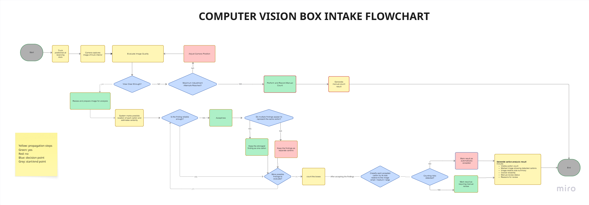

# CVision Visual Box Intake

*Internal R&D case study — computer-vision carton intake prototype*

**Project type:** Research and development prototype

**Status:** Complete. Deployed and publicly accessible end to end.

## Project links

- **Live Streamlit prototype:** [https://cvision-box-intake.streamlit.app/](https://cvision-box-intake.streamlit.app/)
- **GitHub repository:** [https://github.com/ZahraAbbas595/cvision-box-intake](https://github.com/ZahraAbbas595/cvision-box-intake)

> The hosted services run on free infrastructure, so the first request after a quiet period is slow. Timings and the messages the user sees are listed under “How the hosted service behaves”.

## 1. Executive Summary

CVision Visual Box Intake is a computer-vision prototype built during a focused engineering sprint. The sprint asked one question: can a photo of cartons inside a truck be turned into a structured, reviewable intake record?

The answer is a working system, not just a model. The prototype takes a truck or carton-stack image, finds the cartons it can see, draws boxes around them, estimates how many are visible, groups them by how much of the image they take up, reports average detection confidence, flags conditions that need a human check, and produces both an annotated image and a downloadable JSON result with model, schema, service and processing versions.

On the final Carton Loading test set of 49 images and 2,537 annotated cartons:

- The predicted count was within two cartons of the annotation in 71.4% of images.
- Mean absolute error was two cartons.
- Box precision was 97.9% and box recall was 96.1%.

This is a useful preliminary count and a measurable baseline. It is not inventory verification. In its current form it does not replace barcode scanning, manifests or physical stock checks.

## 2. Problem Statement

Warehouse and logistics teams can benefit from an early estimate of a truck load before every carton has been unloaded and scanned. A truck photo holds useful information, but getting a reliable count out of it is hard:

- Cartons are often tightly packed.
- Cartons deeper inside the truck look very small.
- Some cartons are partly hidden.
- Repeated edges can look like separate objects.
- Shadows and reflections affect visibility.
- Cartons can be cut off at the edge of the image.
- Packaging, camera position and truck layout all vary.

The sprint explored whether a lightweight vision pipeline could make this information structured and reviewable, and whether the system could be honest about when it should not be trusted.

## 3. Objective and Scope

**The research question:**

Can a lightweight computer-vision system turn a truck image into an annotated intake result that contains carton detections, an estimated count, uncertainty information and clear human-review guidance?

The goal was wider than training a model. The sprint covered:

- Dataset preparation
- Model training
- Operational evaluation
- Image validation
- Detection post-processing
- Human-review rules
- Backend API development
- Frontend development
- Cloud deployment
- Automated testing
- Documentation and technical handoff

This was deliberate. A detector with a good score and nothing around it would not have answered the operational question. The sprint was designed to produce a running service that shows its own uncertainty.

## 4. How the System Is Built

Image upload or capture

↓ Streamlit operator interface

↓ FastAPI inference service

↓ Image validation and quality checks

↓ Fine-tuned YOLOv8n detector

↓ Counting, size grouping and review rules

↓ Annotated image and structured JSON evidence

### How it would be used day to day

The diagram below shows the full workflow the prototype would sit inside. It includes the operator steps needed to get a usable image, respond to quality feedback and fall back to manual counting when the photo is not good enough. It describes the intended process, not a claim that every stage is automated today.

*Figure 1. The expected workflow around the prototype. Operator-controlled and future stages sit outside the current automation boundary.*

**What the prototype actually does today:** image upload or capture, file and image validation, image-quality checks, carton detection, confidence filtering, overlap suppression, fragmented-detection risk checks, visible-carton counting, image-relative size grouping, review-risk checks, annotated image generation and structured result generation. Camera repositioning is done by the operator. Tracking adjustment attempts and recording manual counts are expected workflow stages that sit outside the prototype.

### Streamlit interface

The interface lets a user:

- Upload or capture a truck image
- View the original image
- View the annotated result
- See the predicted visible-carton count
- See image-relative carton-size groups
- See average confidence of accepted detections
- See whether review is recommended
- Read the review reasons and suggested actions
- Inspect technical metadata
- Download the structured JSON output

### What the backend does

The backend handles request and file validation, image decoding, image-quality analysis, model inference, detection filtering, carton counting, relative-size grouping, review-rule checks, annotation drawing and versioned response generation. It also exposes health and version endpoints for deployment checks.

### How the hosted service behaves

- **Cold backend:** 27 seconds
- **Warm analysis:** 2 seconds
- **Cold-start message:** “Waking up the service if needed and analyzing the image…”
- **Timeout message:** “Analysis took too long. The service may still be waking up.”
- **Backend-unavailable message:** “The analysis service is not responding. Try again shortly.”

## 5. The Choices We Made and Why

- **Detector: fine-tuned YOLOv8n.** Chosen for its balance of detection performance, model size, CPU inference, deployment cost and ONNX support. The constraint was operational, not academic: the model had to run cheaply in a hosted service.
- **ONNX export for the hosted service.** The selected checkpoint was exported to ONNX, which cut production memory use and dependencies.
- **Parity checks before trusting the export.** The deployed ONNX and PyTorch paths produced matching accepted carton counts across all 49 evaluation images. That confirms the deployment matches the tested model; it is not evidence that the model itself is perfectly accurate.
- **Evaluation kept separate.** The evaluation data was kept out of fine-tuning and threshold selection, and we audited for dataset leakage. The reported numbers describe unseen data.
- **Tested with production settings.** The evaluation used the same confidence threshold (0.45), NMS IoU threshold (0.30), image size (640) and accepted-detection logic as the deployed app, so the measured behaviour reflects the shipped system rather than a flattering offline setup.
- **Fixed review rules instead of confidence alone.** Review recommendations come from explicit conditions, not a confidence score. See section 9.

## 6. Evaluation Methodology

The final evaluation used the Carton Loading dataset.

| Property | Value |
| --- | --- |
| Images | 49 |
| Annotated cartons | 2,537 |
| Scene type | Truck and carton-loading scenes relevant to the target workflow |
| Annotation class | Dedicated `cartonbox` class |

**Settings:** confidence threshold 0.45, NMS IoU threshold 0.30, image size 640, deployed accepted-detection logic.

Counting was measured by exact count, count within one carton, count within two cartons, mean absolute error, and whether the system over- or under-counted. We measured at image level rather than only at detection level for a simple reason: the operator sees a count, so the count is what matters.

### How well it finds individual cartons

The same 49 images were also scored with standard IoU-matched detection metrics, which check whether each predicted box lands on an annotated carton.

| Detection measure | Result |
| --- | --- |
| Box precision | 97.9% |
| Box recall | 96.1% |

Precision is the share of predicted boxes that matched a real carton. Recall is the share of real cartons that were found. These are not the same as exact-count accuracy; section 8 explains why.

## 7. How Well It Counts

One point of context first. These numbers reflect the conditions in the evaluation images, which include small and distant cartons, partial visibility, dense repeated edges and cartons cut off at the image edge. Those are the hardest conditions for single-image detection.

| Operational measure | Result |
| --- | --- |
| Images evaluated | 49 |
| Annotated cartons | 2,537 |
| Predicted cartons | 2,497 |
| Exact match with annotation | 49.0% |
| Within ±1 carton | 63.3% |
| Within ±2 cartons | 71.4% |
| Mean absolute error | 2.00 cartons |

**The main finding:**

Across the 49-image Carton Loading evaluation, the predicted count was within two cartons of the annotation in 71.4% of images, with a mean absolute error of two cartons.

The within-±2 figure is the number that matters operationally, because the prototype produces a preliminary estimate rather than a verified count. The exact-count figure is reported for completeness and should not be used as a headline claim. A single-image system cannot verify what it cannot see.

## 8. Interpreting the Results

This is a baseline for an R&D prototype, not a performance guarantee.

The model was most reliable when:

- Carton edges were clearly visible
- The stack faced the camera
- Cartons took up enough of the image
- Lighting was adequate
- Little was hidden behind other cartons

The hardest cases were:

- Small cartons deep inside a truck
- Partly visible cartons
- Dense repeated edges
- Unclear separation between neighbouring cartons
- Cartons touching the image edge
- Poor image quality

### Finding cartons and counting them are not the same thing

The gap between the detection scores and the exact-count score is a real finding, not a contradiction. In an image with many cartons, the detector can correctly place the large majority of boxes and score high on precision and recall. Exact-count scoring is stricter: an image only counts as exact if nothing is missed and nothing is added. One missed or one duplicated carton is enough to fail it.

That is why the prototype exposes detection evidence, confidence and review conditions instead of reducing everything to a single percentage that could mislead.

## 9. When the System Asks for a Human Review

Review is triggered by fixed rules, not by confidence alone. Conditions include:

- Unreadable images
- Blur
- Poor exposure
- Resolution too low
- No accepted detections
- Important detections touching the image edge
- Geometry that suggests one carton was split into several detections

One more design decision is worth recording: optional AI-generated visual observations are advisory only. They cannot change the count or trigger human review on their own. Narrative output stays out of the decision path.

## 10. What Was Built

The sprint delivered a maintainable system, not a notebook:

- A truck-carton-specific detector
- A repeatable model-training and external evaluation workflow
- Dataset-leakage auditing
- PyTorch-to-ONNX conversion with backend parity validation
- A typed FastAPI inference service
- A Streamlit operator interface
- Image validation, quality checks and review rules
- Annotated output and structured JSON output, with model and schema versioning
- Safe error handling
- Automated tests, continuous integration and protected branch promotion
- Separate frontend and backend deployments
- Deployment and handoff documentation

### What this delivers

Taken together, the prototype turns one unstructured truck photo into:

- A preliminary visible-carton estimate
- An annotated visual record
- Clear uncertainty and review information
- Guidance for the operator
- A structured, machine-readable result
- Traceable model and processing metadata

That is an end-to-end technical foundation for producing preliminary, transparent and reviewable carton-intake evidence from truck images.

## 11. Limitations

### Data

- The model was fine-tuned on roughly 494 images. That is a small training set for a task with this much visual variety, and it is the main limit on current counting performance.
- The evaluation used 49 images, so the reported percentages carry limited statistical weight.
- The data does not come from the environment where the system would actually be used. Truck structure, camera type and distance, lighting, loading arrangement, carton design and colour, packaging damage, occlusion and how operators take photos all differ between datasets and real sites.
- The counting rules in the annotations are the dataset’s, not a customer’s. No written visible-carton annotation policy has been agreed with an end user.
- A larger real-world dataset would be needed before the counting behaviour could be called representative of any specific warehouse.

### System

- It only estimates cartons it can actually see.
- Hidden cartons cannot be verified from one image.
- Very small or distant cartons may be missed.
- Repeated edges can produce duplicate detections.
- Detection confidence is not count confidence.
- Size grouping is relative to the image. The system does not measure physical dimensions.
- Dense loads may need closer or multiple photos.
- It does not identify SKUs or read barcodes.

### Deployment

- It is not connected to a warehouse-management system.
- It has not been validated in a customer environment.
- Production use would need security, storage, monitoring and governance work.

These limitations define the next phase. They do not invalidate the completed prototype.

## 12. Why Customer-Specific Data is the Next Step

Vision performance depends heavily on the environment the training data represents, and real deployment conditions differ from the datasets used here.

Customer images would let the team:

- Define the customer’s exact counting rules
- Measure performance under real operating conditions
- Find the failure cases specific to that site
- Fine-tune the detector on relevant examples
- Calibrate confidence and review thresholds
- Build a locked customer acceptance set
- Decide whether performance meets the customer’s requirements

The current evaluation is a repeatable baseline. A larger customer-domain dataset would give the model a better chance to learn the patterns that matter in a specific warehouse. Whether performance improves, and by how much, must be measured on a separate locked evaluation set rather than assumed.

## 13. What We Would Do Next

1. Collect a larger, representative image set from the intended operating environment.
2. Agree one written visible-carton annotation policy with the end user.
3. Fine-tune the detector on the customer domain.
4. Test higher-resolution and tiled inference.
5. Evaluate multiple-image capture for dense loads.
6. Calibrate confidence and review thresholds on validation data only.
7. Measure exact, ±1, ±2, overcount and undercount performance on a locked customer acceptance set.
8. Agree acceptance criteria with stakeholders.

## 14. Production-Readiness Notes

This is an R&D deliverable. It is not deployed for a client and it is not production-ready. Still needed:

- **A larger real-world dataset.** Enough representative imagery from actual receiving operations.
- **Warehouse-specific validation.** Measured performance under the site’s own capture conditions and counting rules.
- **Reliable physical size measurement.** The current output is image-relative size grouping, not real dimensions.
- **User authentication.** Controlled access to the service and its results.
- **Secure evidence storage.** Protected retention of images, annotated outputs and structured results.
- **Monitoring.** Visibility of service health, inference behaviour and result quality over time.
- **Data-retention rules.** A defined policy for how long image and result data is kept and how it is disposed of.
- **WMS, POD or DANI integration.** A connection to the systems that hold the authoritative inventory record.
- **A feedback loop.** A process that captures operator corrections and feeds them back into training data.

## 15. Conclusion

CVision Visual Box Intake met its R&D objective: a working, publicly accessible, end-to-end prototype. It demonstrated carton detection, preliminary counting, annotated evidence, clear review guidance, structured API results, model deployment, repeatable evaluation, honest limitations and a defined route to customer-specific validation.

The 49-image evaluation gives a measurable baseline across both detection and counting, and the two are reported separately on purpose.

**Final positioning:**

CVision Visual Box Intake is a completed end-to-end R&D prototype that demonstrates strong carton localization, preliminary visible-carton counting, transparent review logic, deployed inference and a repeatable baseline for future domain-specific validation.
