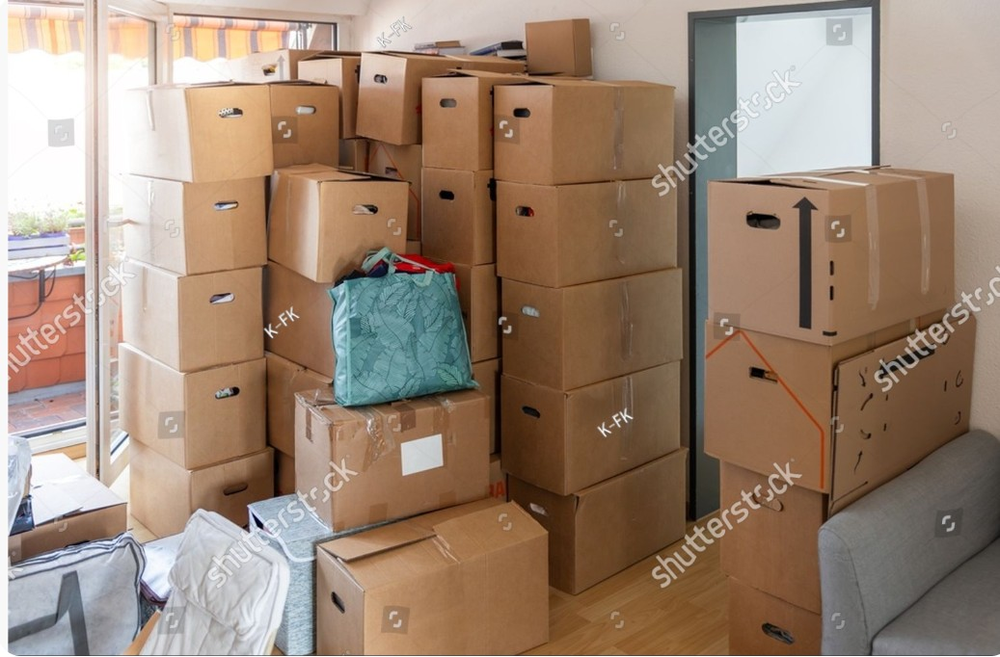
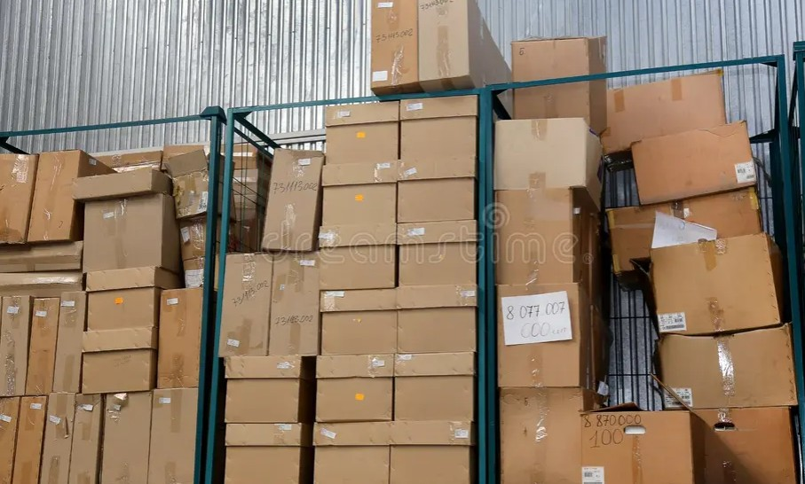
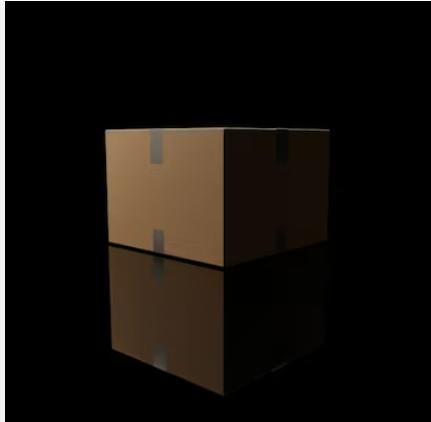

# Error Analysis

## Scope

This analysis covers all 31 evaluation images at the deployed ONNX operating
point of confidence `0.47`, NMS IoU `0.25`, and inference size `640`. All counts
were reviewed from the full-resolution images. Eighteen images have exact
counts and thirteen do not.

The dataset intentionally retains difficult and unsupported examples. Results
are therefore reported both for the complete set and for the supported-scene
subset that excludes only the documented reflection case, `img_020.jpg`.

## Counting Rule

A carton counts whenever its visible region identifies it confidently as a
distinct physical carton. Partial, border-cropped, damaged, open, and wrapped
but visually identifiable cartons count. Extremely small or ambiguous
fragments that cannot be separated reliably are excluded. A shadow or
reflection does not create another physical carton.

## Count Results

| Metric | Full set | Supported scenes |
| --- | ---: | ---: |
| Reviewed images | 31 | 30 |
| Exact-count images | 18 | 18 |
| Exact-count accuracy | 58.1% | 60.0% |
| Mean absolute count error | 1.42 | 1.43 |
| Overcount images | 6 | 5 |
| Undercount images | 7 | 7 |

The full-set result is the primary honest dataset result. The supported-scene
result answers a narrower question: how the detector performs after applying a
predeclared operational limitation. `img_020.jpg` is not deleted and is not
silently removed from reporting.

## Incorrect Counts

| Image | Expected | Predicted | Error | Primary finding |
| --- | ---: | ---: | ---: | --- |
| `img_003.png` | 11 | 24 | +13 | Window/background false positives and crowded-scene overcount. |
| `img_005.jpg` | 14 | 13 | -1 | One shadowed or partially obscured carton missed. |
| `img_012.jpg` | 4 | 3 | -1 | One person-occluded carton missed. |
| `img_013.jpg` | 7 | 8 | +1 | One carton likely represented twice. |
| `img_016.jpg` | 1 | 2 | +1 | Background box-like region treated as a carton. |
| `img_020.jpg` | 1 | 2 | +1 | Unsupported reflection/shadow treated as a second carton. |
| `img_022.jpg` | 1 | 0 | -1 | Stylized open carton completely missed. |
| `img_023.jpg` | 1 | 2 | +1 | Damaged carton fragmented into detections. |
| `img_026.jpg` | 6 | 4 | -2 | Clutter and partial obstruction cause misses. |
| `img_027.jpg` | 58 | 47 | -11 | Dense stack causes small, partial, and border misses. |
| `img_028.jpg` | 10 | 5 | -5 | Occlusion and background clutter cause multiple misses. |
| `img_030.jpg` | 1 | 5 | +4 | One physical carton severely fragmented across visible regions. |
| `img_031.jpg` | 9 | 7 | -2 | Overlap and foreground occlusion cause misses. |

## Error Taxonomy

The taxonomy is multi-label: one image can contribute to more than one category
when, for example, occlusion causes a missed carton. Counts below cover the 13
incorrect-count images at the deployed operating point.

| Category | Images | Count | Interpretation |
| --- | --- | ---: | --- |
| Missed box | `005`, `012`, `022`, `026`, `027`, `028`, `031` | 7 | One or more visible cartons were not detected. |
| Duplicate or fragmented box | `013`, `023`, `030` | 3 | One physical carton produced multiple accepted detections. |
| Non-box detected as box | `003`, `016`, `020` | 3 | Background geometry, clutter, or reflection created a false carton. |
| Partially hidden or overlapping box | `005`, `012`, `026`, `027`, `028`, `031` | 6 | Occlusion contributed to an undercount. |
| Incorrect size class | Not measured | 0 evaluated | Reviewed localization and size-class labels are not available. |
| Poor image quality or lighting | `005`, `020` | 2 observed | Shadow or low light contributed to ambiguity; no independent quality classifier is claimed. |
| Unsupported scene | `020` | 1 | Reflection creates a visually inseparable false carton. |
| Possible visible damage | `023`, `030` | 2 | Damage or separated visible regions contributed to fragmentation. |
| No useful detection | `022` | 1 | A visible stylized carton received zero detections. |

This table classifies observed failures rather than claiming that every listed
condition can be detected automatically.

## Representative Sprint Examples

These five examples provide a concise demonstration set. Generated overlays
remain evaluation artifacts and are not committed. The source images below are
already tracked evaluation evidence; predicted and expected counts are stated
beside each image.

### `img_006.jpg`: dense-scene success

- Expected: 25
- Predicted: 25
- Demonstrates that a crowded scene can still produce an exact operational
  count; scene difficulty alone does not determine failure.

### `img_010.jpg`: clear multi-carton success

- Expected: 4
- Predicted: 4
- Demonstrates the normal supported workflow with four distinct cartons.
- The count is correct even though the displayed bounding-box lines could be
  made more visible in the user interface.

### `img_003.png`: severe overcount

- Expected: 11
- Predicted: 24
- Rectangular window/background regions and crowded geometry create phantom
  inventory. A global confidence change is unlikely to solve this safely.

### `img_027.jpg`: severe undercount

- Expected: 58
- Predicted: 47
- Small, overlapping, partial, and border cartons are missed in a very dense
  warehouse stack. This should be presented as a high-risk review scene.

### `img_020.jpg`: unsupported reflection scene

- Expected: 1
- Predicted: 2
- A low-light reflection or shadow strongly resembles another carton. The image
  remains in the dataset as limitation evidence and is excluded only from the
  separately labelled supported-scene metric.

## Human-Review Rules

Review rules do not change, merge, add, or remove detections. They set
`review_required` and add a reason so an operator knows not to trust the count
without checking the evidence image.

Candidate rules must be tested offline against all 31 images before deployment:

1. Keep zero detections reviewable; this covers complete misses such as
   `img_022.jpg`.
2. Keep high detection counts reviewable; they indicate operational risk in
   scenes such as `img_003.png` and `img_027.jpg`, even when a crowded scene
   happens to have an exact count.
3. Test fragment geometry on damaged or single-carton scenes such as
   `img_023.jpg` and `img_030.jpg`; do not automatically merge boxes.
4. Test border-density and overlap signals for crowded undercount scenes. A flag
   may identify risk but cannot recover cartons that the model never detected.
5. Treat reflection, severe occlusion, and stylized appearance as documented
   unsupported or uncertain conditions until a validated image-level signal is
   available.

A candidate rule is useful when it catches meaningful count-risk cases with an
acceptable review burden. Operational review flags are not accuracy fixes and
must not be presented as corrected counts.

### Implemented Rule Coverage

| Implemented reason | Signal | Operational purpose |
| --- | --- | --- |
| `no_boxes_detected` | Accepted count is zero | Routes complete misses for review. |
| `low_confidence_detection` | Any accepted confidence is below `0.45` | Exposes weak individual detections. |
| `boxes_cut_off_at_edge` | More than 20% of detections touch the frame | Flags border truncation and possible missed carton extent. |
| `high_detection_count` | At least 12 detections | Routes crowded scenes where overlap and occlusion increase count risk. |
| `possible_fragmented_detections` | A small detection set contains adjacent, aligned fragments | Flags possible duplicate regions without merging detections. |

The fragment rule is deliberately not described as a general occlusion detector.
Crowded overlap is currently represented conservatively by high-count and edge
signals because no validated image-level occlusion classifier exists. This
keeps the operational decision independent of confidence without claiming a
capability the prototype has not demonstrated.

## What Changed After Review

1. Human review now covers all 31 images, including the seven formerly reserved
   crowded scenes.
2. Corrected counts replace the earlier incomplete 24-image metric.
3. `img_020.jpg` remains in full-set reporting and is explicitly classified as
   an unsupported reflection scene.
4. The deployed thresholds remain unchanged. The new evidence does not justify
   a global threshold adjustment because the set contains both severe
   overcounts and severe undercounts.
5. Automatic detection merging remains disabled.

## Limitations

- Thirty-one public or staged images are not warehouse-scale validation.
- Count labels are human-reviewed, but machine-readable ground-truth bounding
  boxes and size classes are not yet available for localization metrics.
- The dataset contains difficult scenes selected for error analysis, so the
  result is not a claim about all future images.
- Damage, reflection, and image-quality classification are not independent
  model tasks in the current prototype.
- Before real warehouse use, the system requires representative operational
  data, independent annotation review, monitoring, and a review-outcome
  feedback process.
