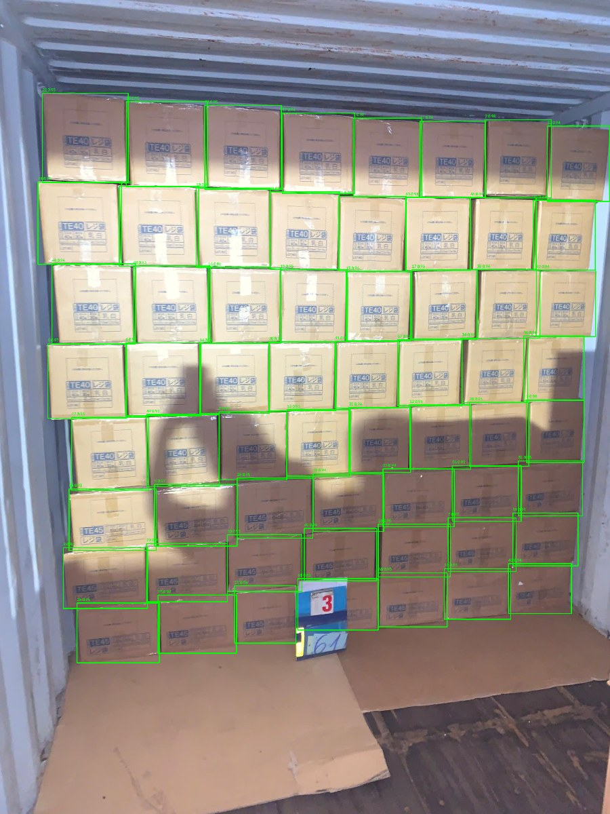
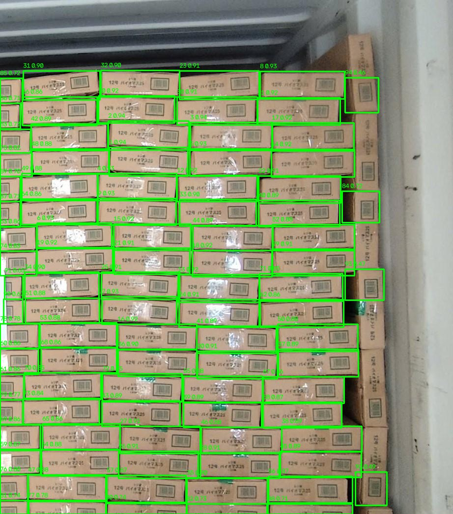
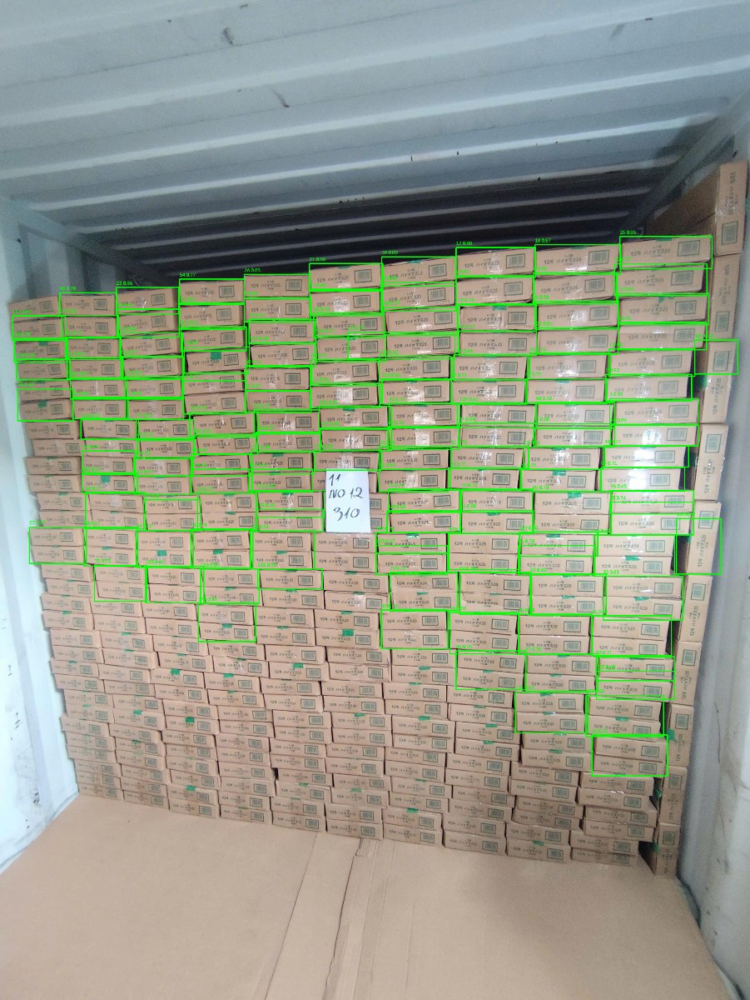

# Count Error Analysis

## Evaluation setup

The locked external set contains 105 truck images and 8,107 annotated cartons.
It is excluded from training and threshold tuning. Results below use the deployed
PyTorch-equivalent settings: confidence `0.45`, NMS IoU `0.30`, image size 640,
and a maximum of 300 detections.

| Scope | Images | Ground truth | Predicted | Exact count | MAE | Overcounts | Undercounts |
| --- | ---: | ---: | ---: | ---: | ---: | ---: | ---: |
| All | 105 | 8,107 | 6,804 | 27.6% | 14.41 | 28 | 48 |
| Boxintake | 56 | 5,570 | 4,307 | 8.9% | 25.27 | 19 | 32 |
| Carton loading | 49 | 2,537 | 2,497 | 49.0% | 2.00 | 9 | 16 |

The totals include 29 exact images, 28 overcounts, and 48 undercounts. Exact
count is deliberately reported alongside precision, recall, and mAP because a
warehouse operator experiences count error directly.

## Annotated examples

### Exact count: 61 expected, 61 predicted



The regular front-facing stack has clear carton boundaries. This is the target
operating pattern and demonstrates that a dense image does not require review
merely because it contains many cartons.

### Overcount: 74 expected, 94 predicted



Thin side faces and tightly adjacent boundaries create duplicate or fragmented
regions. The likely operational effect is accepting more cartons than are
actually visible. The fragmented-detection rule is intentionally conservative;
it cannot reliably repair a count and therefore only provides review evidence.

### Undercount: 310 expected, 136 predicted



Very small cartons in the lower and distant parts of the stack fall below the
detector's reliable resolution and confidence. This is the dominant high-impact
failure mode. A closer image, multiple viewpoints, tiling, or a higher-resolution
warehouse-specific model would be required before operational use.

## Error categories and response

| Category | Observed effect | Current response | Remaining work |
| --- | --- | --- | --- |
| Missed small/occluded carton | Undercount | Preserve annotated evidence; deterministic quality and edge checks | Add warehouse data, tiled inference, and multi-view capture |
| Duplicate/fragmented carton | Overcount | Conservative geometric review signal | Train on damaged/partial faces and validate duplicate suppression |
| Non-carton lookalike | False positive | Advisory visual observation | Collect operator-confirmed negatives |
| Poor blur/exposure/resolution | Miss or unstable boundary | Deterministic retake guidance | Calibrate thresholds on target cameras |
| Incorrect relative size | Wrong small/medium/large bucket | Explicitly label size as image-relative | Add camera calibration for physical dimensions |
| Hidden cartons | Cannot be counted from one image | Do not infer invisible inventory | Compare multiple views and manifest/barcode evidence |

The evaluation is reproducible with:

```powershell
python scripts/evaluate_external_counts.py `
  --model models/carton_yolov8n_truck_best.pt `
  --dataset external_test/combined `
  --confidence 0.45 `
  --iou 0.30
```
