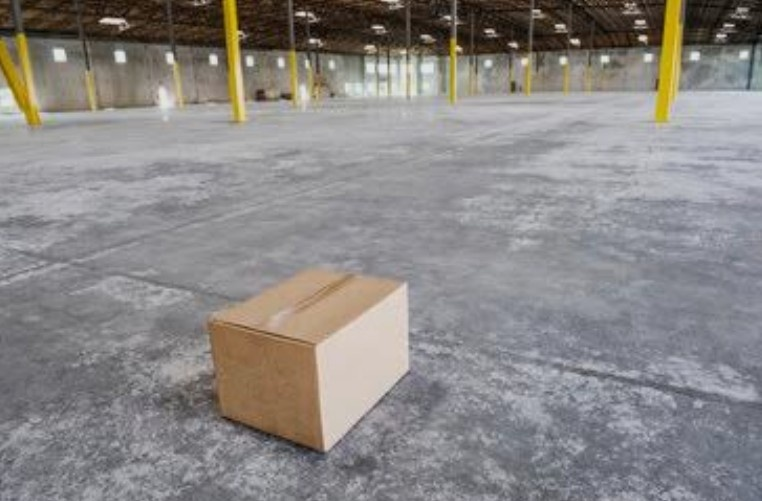
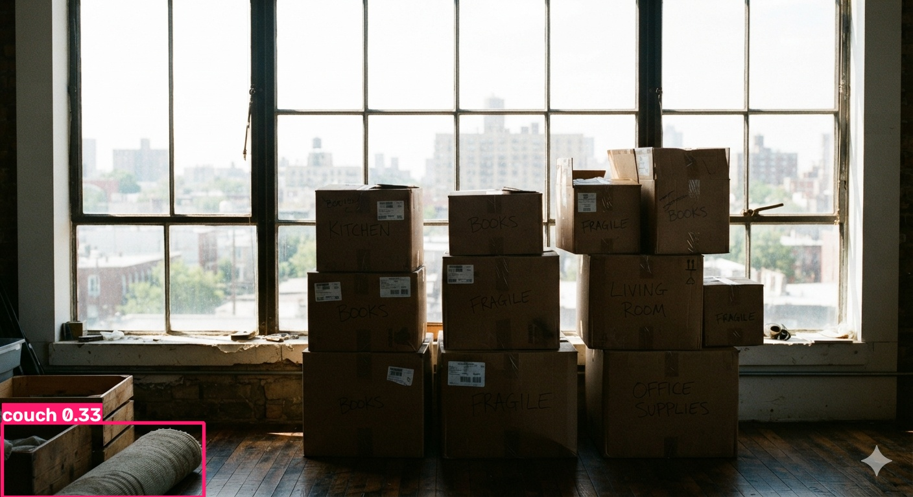
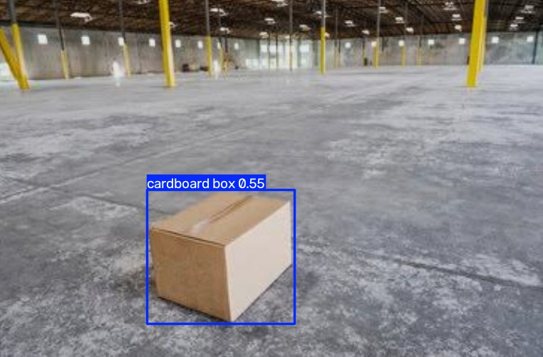
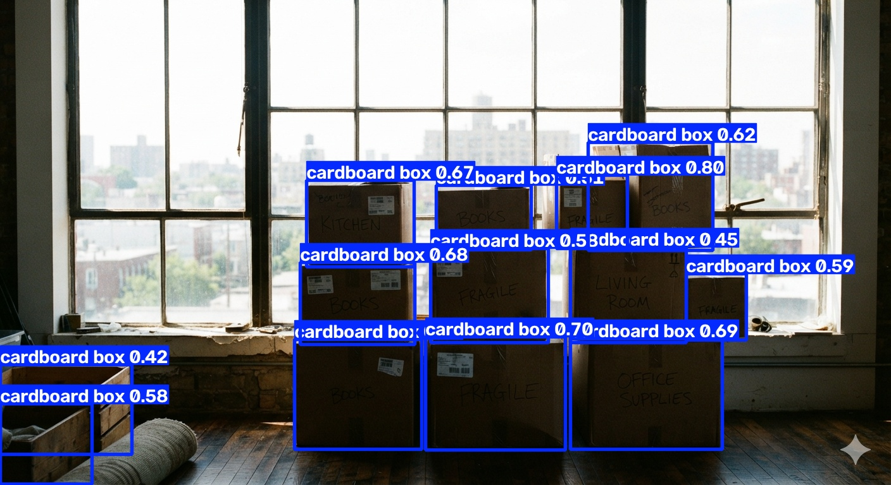
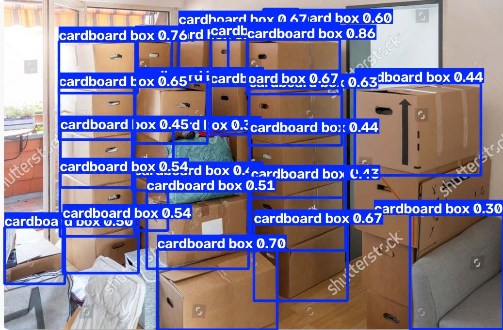

# Historical Annotated Examples

These five curated overlays preserve visual evidence from the Week 1 baseline
experiments. They are documentation assets, not current ONNX evaluation output.

## COCO YOLOv8n Baseline

The generic COCO model has no carton class. These examples show why it was
rejected: a clear carton is not detected, while a non-carton object can receive
an unrelated COCO label.

## YOLO-World Baseline

YOLO-World established that open-vocabulary carton detection was feasible, but
the crowded examples also show overlapping labels and unstable operational
counts. Its memory footprint later exceeded the Render Free limit.

Current truck-model results and limitations are documented separately in
`docs/truck_model_evaluation.md`.
